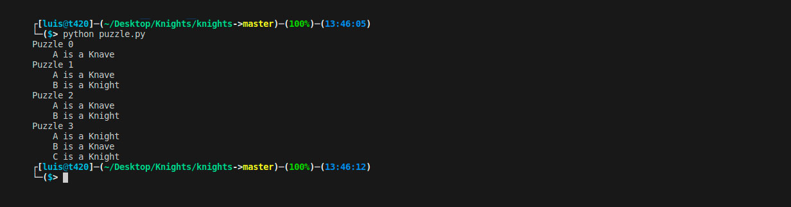

# Knights

## A program to solve logic puzzles.

In 1978, logician Raymond Smullyan published “What is the name of this book?”, a book of logical puzzles. Among the puzzles in the book were a class of puzzles that Smullyan called “Knights and Knaves” puzzles.

In a Knights and Knaves puzzle, the following information is given: Each character is either a knight or a knave. A knight will always tell the truth: if knight states a sentence, then that sentence is true. Conversely, a knave will always lie: if a knave states a sentence, then that sentence is false.

The objective of the puzzle is, given a set of sentences spoken by each of the characters, determine, for each character, whether that character is a knight or a knave.

With more characters and more sentences, the puzzles can get trickier. The task in this project is to determine how to represent these puzzles using **propositional logic**, such that an AI running a **model-checking** algorithm could solve these puzzles for us.

## Implementation

At `logic.py`, we define several classes for different types of logical connectives. These classes can be composed within each other, so an expression like `And(Not(A), Or(B, C))` represents the logical sentence stating that symbol `A` is not true, and that symbol `B` or symbol `C` is true (where “or” here refers to inclusive, not exclusive, or).

`logic.py` also contains a function `model_check`. `model_check` takes a knowledge base and a query. The knowledge base is a single logical sentence: if multiple logical sentences are known, they can be joined together in an `And` expression. `model_check` recursively considers all possible models, and returns `True` if the knowledge base entails the query, and returns `False` otherwise.

At `puzzle.py`, we define six propositional symbols. `AKnight`, for example, represents the sentence that “A is a knight”, while `AKnave` represents the sentence that “A is a knave.” We similarly define propositional symbols for characters B and C as well.

What follows are four different knowledge bases, `knowledge0`, `knowledge1`, `knowledge2`, and `knowledge3`, which contain the knowledge needed to deduce the solutions to the upcoming Puzzles 0, 1, 2, and 3, respectively.

The `main` function of this `puzzle.py` loops over all puzzles, and uses model checking to compute, given the knowledge for that puzzle, whether each character is a knight or a knave, printing out any conclusions that the model checking algorithm is able to make.

### Representing the puzzles using propositional logic

For each knowledge base, we want to encode two different types of information: (1) information about the structure of the problem itself (i.e., information given in the definition of a Knight and Knave puzzle), and (2) information about what the characters actually said.

Considering what it means if a sentence is spoken by a character. Under what conditions is that sentence true? Under what conditions is that sentence false? How can we express that as a logical sentence?

There are multiple possible knowledge bases for each puzzle that will compute the correct result. We attempt to choose a knowledge base that offers the most direct translation of the information in the puzzle, rather than performing logical reasoning on our own. We should also consider what the most concise representation of the information in the puzzle would be.

For instance, for Puzzle 0, setting `knowledge0 = AKnave` would result in correct output, since through our own reasoning we know 'A' must be a knave. But doing so would be against the spirit of this problem: the goal is to have our AI do the reasoning for us.

## Resources
* [Knowledge - Lecture 1 - CS50's Introduction to Artificial Intelligence with Python 2020][cs50 lecture]

## Usage

**To solve logic puzzles:** 

* Inside the `knights` directory: `python puzzle.py`

## Credits
[*Luis Sanchez*][linkedin] 2020.

Project and images from the course [CS50's Introduction to Artificial Intelligence with Python 2020][cs50 ai] from HarvardX.

[cs50 lecture]: https://www.youtube.com/watch?v=LucW-p6zC5c&feature=youtu.be
[linkedin]: https://www.linkedin.com/in/luis-sanchez-13bb3b189/
[cs50 ai]: https://cs50.harvard.edu/ai/2020/
